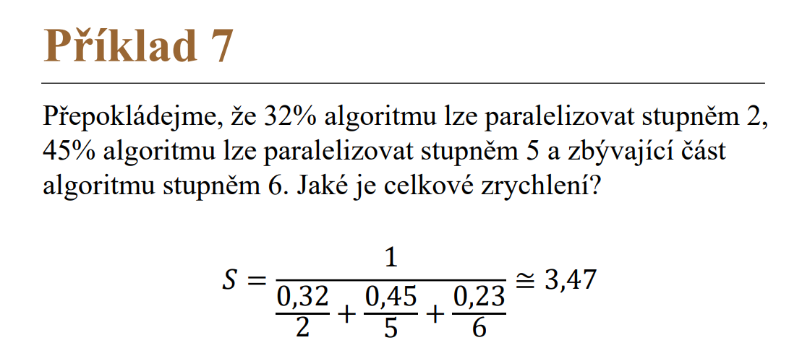
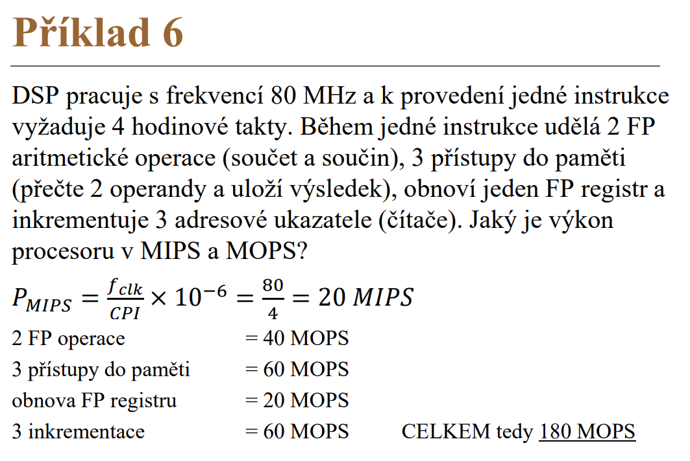

# Teoretická část - poznatky
- **výkonnost systému** $P_t$
	- $P_t = \frac{1}{T}; \quad T=\text{doba provedení jednoho úkonu}\quad [MIPS]$
- **propustnost systému** $P_r$
	- $P_r = \frac{n}{t}; \quad \text{počet úkonů n za čas t}\quad [MIPS]$
- **doba provádění programu** $T_{CPU}$
	- $T_{CPU} = IC * CPI * T_{CLK}$
	- $\text{IC = instruction count; CPI = cycles per instruction; Tclk = perioda hod. signálu}$
- **zrychlení systému** $S_{OVERALL}$
	- $S_{OVERALL} = \frac{T_{OLD}}{T_{NEW}} \quad \text{Told/new = výkonnost bez/s vylepšení/m}$
- vzorce na kódování (záporných) čísel z decimální do binární:
	- **doplňkový kód** (dvojkový doplněk)
		- = inverze všech bitů a přičíst 1
	- **aditivní kód**
		- lichý = $X +2^{n-1}-1$
		- sudý = $X +2^{n-1}$
		- kde $n = \text{počet bitů vstupu}$
	- **přímý kód**
		- absolutní hodnota čísla, MSB je znaménkový bit
		- `MSB = 1`: záporné číslo
		- `MSB = 0`: kladné číslo
	- **IEEE 754** (reálné číslo, 32bit mód)
		- big endian (MSB je první) / little endian (LSB je první)
		- znaménkový bit funguje stejně jako u přímého (1 záporné, 0 kladné)
		- nejdříve převést na binární formát, poté (od bitu nejvíce vlevo) rozdělit na části následujícím způsobem:
			- **1bit znaménko mantisy $S$, 8bit exponent $E$, 23bit mantisa $M$**
		- mantisa $M$ se ještě musí převést na desetinné číslo: $\overline{M} = \sum_{i=1}(M_i * 2^{-i})$
		- DEC hodnota je poté: $X = (-1)^S * 2^{E-127} * (\overline{M})$
- opačné vzorce (do decimální)
	- aditivní kód
		- lichý = odečíst ($X^{n-1}$ - 1)
		- sudý = odečíst $X^{n-1}$ 
- z `HEX` do `BIN` (nebo obráceně)
	- skupinky po 4 bitech
- sběrnice obecně
	- informační cesta pro přenos informací mezi funkčními bloky systému
	- soustava vodičů, která přenáší data stejného charakteru (typicky master-slave)
	- dělení: dvou/více bodové, dlouhé/krátké spoje, jedno/obou směrné, serial/parallel
	- vyžadují impedanční zakončení terminátory, protože jde o dlouhé vedení
- chipset obecně
	- řídí komunikaci na MOBO
		- plní funkci řadiče, RAM i cache
	- určuje typ/počet/kapacitu: CPU, RAM, ...
	- obsahuje rozhraní pro PATA, SATA, USB, LAN, ...
	- definuje systémovou sběrnici mezi CPU a okolím
	- dříve severní/jižní můstek
		- dnes funkce severního můstku v CPU, zbytek v Controller Hub
- věci:
	- struktura počítače je nezávislá na typu řešené úlohy (mění se jen paměť)
	- program tvoří posloupnost instrukcí
		- změna pořadí pomocí (ne)podmíněného skoku
	- tok dat řídí řadič
	- mikroinstrukce - další dělení instrukcí v CPU
		- mikroinstrukce je uložena v ROM, její vykonání většinou trvá 1 takt
	- ISA - Instruction Set Architecture
		- rozhraní mezi HW a SW počítače (způsob kódování instrukcí, možné operace, datové typy, ...)
	- instrukční cyklus = skupina všech fází nutných k uskutečnění strojové instrukce
		- fetch -> decode -> operand fetch -> exec -> memory operation -> write
	- pipelining (zřetězení) = CPI je více než 1
		- vkládá dodatečné registry mezi jednotlivé části řadiče
		- vnitřně zavádí paralelismus, venku se tváří sekvenčně
	- čísla s plovoucí řádovou čárkou: $A = M * 2^E$ ($M$antisa, $E$xponent)
		- IEEE 754, hodnota exponentu posouvá deset. čárku, mantisa určuje přesnost
	- mikropočítač = realizace obvodů na jedné desce plošných spojů (mobil, server, MCU)
	- mikrořadič = mikroprocesor s pamětí a periferiemi (typicky RISC + Harvard)
	- paměti, cache, RAM / $\text{\{[(E)E]P\}ROM}$
	- RS-232, u počítače COM port, dnes nahrazován USB
		- ale stále využíván v průmyslu, sériová komunikace
	- chipset = řídí komunikaci na základní desce, power management, typ/počet/kapacitu CPU, pamětí
	- GPU vykreslují 3D data na 2D obraz, aplikují shadery, masivně paralelní architektura
	- u mobilních CPU důraz ne nízkou spotřebu
___

# Písemná část - možné otázky

## 1. – char. vlastnosti
- **Uveďte char. vlastnosti von Neumanovy architektury počítačů**
	- společná paměť pro program (instrukce) + data (operandy)
		- paměť rozdělená do buněk stejné velikosti
	- vstupy se berou jako datové zdroje, výstupy jako výsledky, napojeny přímo na ALU
	- – porovnání
		- jednodušší návrh, horší paralelizace, procesor řeká na dokončení I/O operací (sdílená sběrnice), složitější debugging
	- riziko že se data mylně interpretují jako program
- (2024) Uveďte char. vlastnosti Harvardské architektury počítačů
	- oddělená paměť programu a dat
		- paměti můžou mít odlišnou konstrukci, lze přistupovat k oběma naráz
	- oddělená sběrnice
	- řízení procesoru odděleno od řízení IO jednotek
	- – porovnání
		- dražší a složitější implementace, vyšší bezpečnost, možnost paralelizace 
	- použití typicky s RISC v MCU
- **Uveďte char. vlastnosti procesurů typu CISC**
	- Complex Instruction Set Computer
	- dříve byly RAM pomalejší než CPU
		- aby se zabránilo bottlenecku, byla snaha rozšiřovat instrukční soubor aby se tolik instrukcí nemuselo načítat z RAM
		- výsledkem je hodně složitých instrukcí, které se využijí zřídkakdy
	- proměnná délka instrukcí, hodně adresovacích módů
	- paměť s mikroprogramy (ROM)
	- zpracování instrukcí ve více stroj. cyklech (CPI ~ 5 – 10)
	- pro překlad programu jednodušší překladač
- **Uveďte char. vlastnosti procesurů typu RISC**
	- Reduced Instruction Set Computer
	- snaha o přesun některých méně používaných instrukcí do programu (snížení CPI)
	- relativně malý počet jednoduchých instrukcí, malý počet adresovacích módů
	- místo mikroprogramování je tam řadič s pevnou logikou (rychlé)
	- víceúčelové registry = jednodušší překladače
	- proudové zprac. instrukcí (CPI < 1.5)
	- nejčastěji se vážou k Harvardské arch.
- **Uveďte char. vlastnosti procesurů typu post-RISC**
	- většina současných CPU
	- kombinace RISC a CISC (navenek CISC, vnitřně RISC)
	- různě dlouhá doba trvání instrukcí, rozklad na jednoduché mikroinstrukce
	- proudové zpracování, paralelizace
	- spekulativní provádění instrukcí
- **Jaký je rozdíl mezi subskalárními, sklárními a superskalárními procesory?**
	- rozdělení vývoje procesorů do tří částí
	- subskalární (sekvenční):
		- tradiční, synchronní
	- skalární:
		- synchronní zpracování nahrazeno paralelním
		- vykonávání instrukcí může probíhat skrytě
		- IPC (Instruction Per Cycle) = 1
	- superskalární:
		- paralelní vydávání i zpracování instrukcí
		- buď statické plánování paralelismu (např. VLIW) nebo dynamické za běhu (složitější)
		- IPC > 1
- **Uveďte char. vlastnosti architektury VLIW procesorů + kde se v souč. používá?**
	- Very Long Instruction Word
	- architektura se čtením s více přístupy, superskalární, lze dělat paralelizaci na úrovni instrukcí
	- delší instrukce které mají dílčí části
	- všechny výkonné jednotky CPU umístěny vedle sebe
	- o paralelizaci rozhoduje překladač (HW nekontroluje hazardy)
		- překladač hlídá kolize v registrech a skládá instrukce, aby se co nejvíce využilo místo v instrukčním slovu
	- větší náročnost na program. paměť
		- v instrukci jsou OPCODy pro všechny jednotky, instrukce jsou dlouhé
		- zároveň náročnější na implementaci, možné problémy se zpětnou kompatibilitou
	- použití: GPU, DSP (Digital Signal Processors)

## 2. – vylepšení procesoru – (příklad)
- **(!) Předpokládejme vylepšení procesoru pro databázové výpočty. Nový procesor je 5x rychlejší než nynější. Dále víme, že nyní je procesor zaměstnán z 65% výpočty a 35% času čeká na vstupně – výstupní operace. Jaké bude celkové zrychlení po plánovaném vylepšení?**
	- $F_E = 0.65; \quad \text{...část, kterou lze zlepšit (výpočty)}$
	- $S_E = 5; \quad \text{...kolikrát se zrychlí výpočet}$
	- $S_{OVERALL} = \frac{1}{(1 - F_E) + \frac{F_E}{S_E}}$
	- $S_{OVERALL} = \frac{1}{(1 - 0.65) + \frac{0.65}{5}}$
	- $= 2.08x$
- **Předpokládejme vylepšení procesoru pro web. Nový CPU je 10× rychlejší pro webové aplikace než nynější. Dále víme, že nyní je CPU zaměstnán ze 40% výpočty a 60% času čeká na I/O operace. Jaké bude celkové zrychlení po plánovaném vylepšení?**
	- VYPOČÍTAT dle 1 (důležitý příklad)
- (2024) Počítač zpracovává program s 40mil dvoutaktovými instrukcemi. Kmitočet hodinových taktů procesoru je 2 GHz. Jaká je výkonnost procesoru v MIPS?
	- todo
- Počítač zpracovává program, který má 5 milionů 1-CPI (jednotaktových instrukcí), 1 milion 2-CPI a 1 milion 3-CPI. Kmitočet hodinových taktů je 100 MHz. Jaká je jeho výkonnost v MIPS?
	- $F_{CLK} = 100MHz$
	- $IC = 5 * 10^6 + 1 * 10^6 + 1 * 10^6 = 7 * 10^6$
	- $N_{CLK} = 5 * 10^6 + 2 * 10^6 + 3 * 10^6 = 10 * 10^6$
	- $T_{CPU} = \frac{N_{CLK}}{f_{CLK}} = \frac{10*10^6}{100*10^6} = 0.1s$
	- $P_{MIPS} = \frac{IC}{T_{CPU}} = 70 \, MIPS$
- **Mikrořadič pracuje s frekvencí 4 MHz. K provedení jednoho instrukčního cyklu vyžaduje 4 hodinové takty. Program má 90% jednocyklových a 10% dvoucyklových instrukcí. Jaký je výkon mikrořadiče v MIPS?**
	- $P_{MIPS} = \frac{f_{CLK}}{CPI}*10^{-6}$
	- $= \frac{4*10^6}{0.9 * 4 + 0.1 * 2 * 4}*10^{-6}$
	- $= 0.9\,MIPS$
- **Výpočetní úloha je rozdělena na 3 části, z nichž každá trvá daný čas (P1 = 20%, P2 = 30% a P3 = 50%). Jaké je celkové zrychlení, jestliže část P1 zrychlíme 5x, část P2 nezrychlíme a část P3 zrychlíme 10x?**
	- $S_{OVERALL} = \frac{T_{OLD}}{T_{NEW}}$
	- $= \frac{1}{\frac{0.2}{5} + \frac{0.3}{1} + \frac{0.5}{10}}$
	- $= 2.56x$
	- další: 
- **Vypočítejte průměrnou dobu přístupu do paměti (systém složený z cache a operační paměti), je-li vybavovací doba cache 12 ns, čas získání dat z operační paměti 160 ns a pravděpodobnost neúspěchu je 10%.**
	- $t = cache * úspěch + ram * neúspěch$
		- pokud se to nepovede z cache, čte se z RAM
	- $t = 12 * (1 - 0.1) + 160 * 0.1$
	- $t = 27ns$
- **(!) Máme 5 stupňovou zřetězenou linku. Jaké bude zrychlení linky, když 20% instrukcí bude mít 4 ztrátové (čekací) cykly, 15% instrukcí bude mít 1 ztrátový cyklus a zbývající počet instrukcí bude bez ztrátových cyklů?**
	- todo
- **(!) Jaká je dosažitelná účinnost zřetězené 4stupňové linky při zpracování 5 instrukcí? Spočtěte dále průměrnou hodnotu CPI. (obrázek, `2010_19_1`, `2019_11_1`)**

	- `x` = čekání na mezivýsledek; `-` = nevyužito

	| Čas | 1 | 2 | 3 | 4 | 5 | 6 | 7 | 8 | 9 |
	|--|--|--|--|--|--|--|--|--|--|
	| S1 | 11 | 12 | 13 | 14 | x | 15 |  | | | 
	| S1 | | 11 | 12 | 13 | x | 14| 15 | | |
	| S1 | | | 11 | 12 | x | 13 | 14 | 15 | |
	| S1 | | | | 11 | 12 | - | 14 | 14 | 15 |
	- $CPI = \frac{9}{5} = 1.8\quad\text{[taktů na 1 instrukci]}$
	- zrychlení $S_{K} = \frac{T_{OLD}}{T_{NEW}}$
		- $= \frac{4*5}{9} = 2.2\quad\quad\text{| kde 9 = čas po paralelizaci; 4*5 = čas při sync provedení}$
	- účinnost $E_K = \frac{S_K}{\text{počet stupňů linky}} = \frac{2.2}{4} = 0.55$
- další sus příklad - vypočítat `MIPS` pro jednu instrukci a pak jen vynásobit počtem instrukcí
	- 

## 3. – simulace registrů – (příklad)
- Uveďte nový stav registrů mikrořadiče rodiny PIC16 po provedení dané posloupnosti čtyř instrukcí:

| (2024) Adresa   |      Hodnota      |  Instrukce |
|----------|-------------|------|
| 0x09 (WREG) | 0xCC | `MOVLW  .113` |
| 0x04 (FSR0L) | 0xCC | `MOVWF  0x04` |
| 0x70 | 0xCC | `BTFSS  0x70,4` |
| 0x71 | 0xCC | `DECF  0x71,W` |

| Stav po instrukcích |  Hodnota |  
|----------|-----------|
| 0x09 (WREG) | 0xCB |
| 0x04 (FSR0L) | 0x71 |
| 0x70 | 0xCC |
| 0x71 | 0xCC |

___
 

| Adresa (DEC)   |      Hodnota (HEX)      |  Instrukce |
|----------|:-------------|------|
| 0x09 (WREG) | 0xAB | `MOVLW  .113` |
| 0x04 (FSR0L) | 0xCD | `MOVWF  0x04` |
| 0x70 | 0xEF | `BTFSC  0x70,4` |
| 0x71 | 0x64 | `DECF  0x71,W` |

| Stav po instrukcích |  Hodnota |  
|----------|-----------|
| 0x09 (WREG) | 0x71 |
| 0x04 (FSR0L) | 0x71 |
| 0x70 | 0xEF |
| 0x71 | 0x64 |

___
 

| Adresa (DEC)   |      Hodnota (HEX)      |  Instrukce |
|----------|-------------|------|
| 0x09 (WREG) | 0xAA | `ADDWF  0x71,F` |
| 0x04 (FSR0L) | 0xAA | `RRF  0x71,W` |
| 0x70 | 0xAA | `BCF  0x70,1` |
| 0x71 | 0xAA | `XORWF  0x71,W` |

| Stav po instrukcích |  Hodnota |  
|----------|-----------|
| 0x09 (WREG) | 0x?? |
| 0x04 (FSR0L) | 0x?? |
| 0x70 | 0x?? |
| 0x71 | 0x?? |

___
 

| Adresa (DEC)   |      Hodnota (HEX)      |  Instrukce |
|----------|-------------|------|
| W | F2 | `ANDLW  F4h` |
| 04 (FSR) | 00 | `MOVF  14,1` |
| 14 | FF | `INCF  14,1` |
| 15 | 00 | `BCF  14,7` |

| Stav po instrukcích |  Hodnota |  
|----------|-----------|
| W | F0 |
| 04 (FSR) | 00 |
| 14 | 00 |
| 15 | 00 |

___
 

| Adresa (DEC)   |      Hodnota (HEX)      |  Instrukce |
|----------|-------------|------|
| W | AA | `ADDWF  15,1` |
| 04 (FSR) | 20 | `BTFSC  14,6` |
| 14 | A0 | `INCF  15,1` |
| 15 | FF | `MOVLW  15` |

| Stav po instrukcích |  Hodnota |  
|----------|-----------|
| W | 15 |
| 04 (FSR) | 20 |
| 14 | A0 |
| 15 | AA |

___
 

| Adresa (DEC)   |      Hodnota (HEX)      |  Instrukce |
|----------|-------------|------|
| W | F3 | `ANDLW  F4h` |
| 04 (FSR) | 14 | `MOVF  14,1` |
| 14 | FF | `INCF  14,1` |
| 15 | 00 | `BSF  14,7` |

| Adresa (DEC)   |      Hodnota (HEX)      |  Instrukce |
|----------|-------------|------|
| W | BB | `ADDWF  15,1` |
| 04 (FSR) | DD | `BTFSC  14,6` |
| 14 | AA | `INCF  4,1` |
| 15 | CC | `MOVLW  15` |

| Adresa (DEC)   |      Hodnota (HEX)      |  Instrukce |
|----------|-------------|------|
| W | F5 | `MOVLW  14` |
| 04 (FSR) | 10 | `MOVWF  4` |
| 14 | BB | `DECF  14,1` |
| 15 | 0F | `BSF  14,1` |

- seznam instrukcí (`l` = literál, `f` = registr, `d` = destination [d=0 -> `W`; d=1 -> zpět do `f`]):
	- obecné:
		- `MOVWF  f` - přesun `W` do `f`
		- `MOVF  f,d` - přesun `f` do `d` 
		- `DECF  f,d` - dekrement `f`
		- `INCF  f,d` - inkrement `f` 
		- `ADDWF  f,d` - součet `W` a `f`
		- `XORWF  f,d` - XOR `W` a `f`
		- `RRF  f,d` - rotace vpravo přes C
	- s literálem `l`:
		- `MOVLW  l` - přesun `l` do `W`
		- `ANDLW  l` - AND `l` a `W`
		- `ADDLW  l` - součet `l` a `W`
	- bitové operace:
		- `BCF  f,b` - clearnout u `f` bit `b`
		- `BSF  f,b` - nastavit u `f` bit `b`
		- `BTFSS  f,b` - test u `f` bitu `b`; přeskočit další pokud set
		- `BTFSC  f,b` - test u `f` bitu `b`; přeskočit další pokud clear

## 4. – převody – (příklad)

- **Jak bude reprezentováno číslo (-12)\_D v pětimístné celočíselné číslicové formě: a) v doplňkovém kódu, b) v aditivním lichém kódu**

  
Řešení

  
  a) 10100, b) 00011

- **Jak bude reprezentováno číslo (-11)\_D v šestimístné celočíselné číslicové formě: a) v doplňkovém kódu, b) v aditivním lichém kódu**

  
Řešení

  
  a) 110101, b) 010101

- **Jak bude reprezentováno číslo (-13)\_D v šestimístné celočíselné číslicové formě: a) v doplňkovém kódu, b) v aditivním lichém kódu**

  
Řešení

  
  a) 110011, b) 010011

- **Číslo zapsané v aditivním sudém kódu má tvar `0110010`. O jaké číslo v desítkové soustavě se jedná? Jak bude vypadat zápis stejného čísla v přímém kódu se znaménkem (zapsaný pomocí stejného počtu bitů)?**

  
Řešení

  
  je to číslo -14, v přímém kódu `1001110`

- **Číslo zapsané v aditivním sudém kódu má tvar `1010101`. O jaké číslo v desítkové soustavě se jedná? Jak bude vypadat zápis stejného čísla v přímém kódu se znaménkem (zapsaný pomocí stejného počtu bitů)?**

  
Řešení

  
  je to číslo 21, v přímém kódu `0010101`

- **(!) Číslo zapsané v 32-bitovém formátu reálného čísla podle IEEE 754 má tvar (big endian): `(C2 81 00 00)_H`. O jaké číslo se jedná (zapsané v desítkové soustavě)?**

  
Řešení

  
  `C2 81 00 00` = `1100 0010 1000 0001 0000 0000 0000 0000`
  - znaménkový bit: `1`
  - exponent: `1000 0101` = $133$
  - mantisa: `000 0001 0000 0000 0000 0000` = $1 + 2^{-7} = 1.0078125$
  - $X = (-1)^1 * 2^{133-127} * 1.0078125$
  - $X = -64.5$
  

## 5. – teorie
- (2024) V čem se liší architektura signálového procesoru vůči běžnému procesoru?
	- signálový - uzpůsoben pro analýzu proudu dat, maticové výpočty, výpočty s vektory,
	- praktické algoritmy, pro které se signálový hodí - Fourierovka, filtry (IIR, FIR)
- **(!) Co víte o architektuře procesorů ISA s univerz. registry? Architekturu charakterizujte, uveďte výhody/nevýhody.**
	- Instruction Set Architecture
	- současná nejpoužívanější architektura (x86)
	- velmi rychlé univerzální registry (GPR), mohou být zdrojem i cílem dat
		- rychlejší než jakákoliv paměť, proto je to výhodné (nutno méně často sahat do paměti)
		- jejich počet je 8 až 128
	- instrukce mají 2 až 3 operandy, snadná implementace paralelismu
	- složitý překladač, registry neumí pole (a další složité dat. strukt.)
	- přepnutí kontextu trvá další dobu
- **Popište výhodu technologie zpracování instrukcí mimo pořadí (out-of-order) a kde se používá.**
	- instrukce se vykonají v jiném pořadí než uvádí program uložený v operační paměti
	- -> procesor rozhoduje o pořadí instrukcí (aby byly zpracovány co nejrychleji)
		- snaží se maximalizovat využití všech částí procesoru
	- kde se používá:
		- moderní Intel procesory, superpočítače, mobilní čipy (výdrž baterie)
- **Popište výhodu technologie spekulativního zpracování instrukcí (speculative execution) a kde se používá.**
	- odhad vykonávání instrukcí dopředu
	- když je CPU méně vytížen, vykonávají se instrukce do budoucna
		- není jisté, zda budou použity
	- důležité je, aby byly výsledky rychle k dispozici (cache)
	- kde se používá:
		- GPU, superpočítače
- (2024) Co víte o technologii Turbo Boost? K čemu slouží a kde se používá?
	- umožňuje jádrům fungovat s vyšší frekvencí
	- pokud to okolnosti dovolují (teplota, spotřeba)
	- použití: vyrovnání vytížení CPU
- (2024) Na jakých principech je založena funkce řadiče procesoru? Uveďte výhody/nevýhody jednotlivých koncepcí.
	- Control Unit - řadič
	- řídí chod CPU, obsahuje instrukčí: registr (uchovává OPCODE instr.) a dekodér (generuje řídící signály pro procesor)
	- může obsahovat podřadiče pro přerušení, IO, periferie, ... 
- **(!) Na jakých principech jsou založeny technologie SSD disků? Uveďte výhody/nevýhody.**
	- todo
- **Na jakých principech je založena funkce řadiče? Uveďte výhody/nevýhody.**
	- řídí chod CPU dle instrukcí programu
	- obsahuje instrukční registr (uchovává OP code aktuální instrukce) + instrukční dekodér
	- funkce:
		- načíst další instrukci -> dekódovat ji -> vygenerovat řídící signály -> vykonat instrukci -> (opakovat)
	- dělení:
		- obvodový: speciální sekvenční automat na míru, rychlejší, dražší, optimalizované pro konkrétní účel
		- mikroprogramový: obecná řídící paměť s mikroinstrukcemi, flexibilnější
	- řadič dále obsahuje podřadiče pro přerušení, IO, periferie...
- (2024) Paralelní víceprocesorové systémy se dělí na volně a těsně vázané. Uveďte, v čem je princip. rozdíl. Za jakých podmínek je výhodnější použití těsně vázaných systémů?
	- volně vázané
		- každý CPU v systému je vybaven velkou lokální pamětí
		- procesory mají autonomii, slabá interakce mezi nimi
		- multipočítače, masivně paralelní počítače, clustery
	- těsně vázané
		- CPU nemají lokální paměť, paměť je sdílená
		- ideálně aby byly všechny CPU v síti rovnocenné (Symmetric Multi-Processor)
		- výhodné za podmínek, že nemáme příliš velké množství procesorů (+ je možné přidat k procesorům cache)
- **(!) Jaké jsou principiální možnosti řešení priorit při více zdrojích přerušení?**
	- programová identifikace
		- k přerušovacímu vstupu procesoru se připojí signály externích přerušení
		- po přijetí žádosti o přerušení se provede cyklické vyvolávání (pooling) připojených zařízení
		- procesor postupně dotazuje všechna zařízení a určuje, které vyvolalo přerušení
		- priorita je určena pořadím zařízení v seznamu dotazování
		- jednoduché na implementaci, ale pomalejší reakce (může být neefektivní)
	- sériová obvodová identifikace (daisy chaining)
		- procesor čeká na identifikační znak, který je generován připojenými zařízeními
		- zařízení jsou propojena sériově (v řetězu) dle priority
		- zařízení s vyšší prioritou blokují ty s nižší (které tedy nikdy nemusí být obslouženy)
		- rychlejší než programová identifikace, ale zase riziko, že pokud jeden článek řetězu selže, ovlivní ostatní
	- řadič přerušení (interrupt controller)
		- specializovaný obvod, který shromažďuje žádosti o přerušení
		- periferie posílají žádosti o přerušení přímo do něj
		- řadič přerušení rozhoduje o prioritě, může měnit aktálně zpracovávané přerušení když přijde nové s vyšší prio
		- efektivní, nejrychlejší, nejdražší, složitá implementace (nároky na specializovaný HW)
- (2024) Co více o sběrnici SPI? Naznačte princip a oblast použití.
	- Serial Peripheral Interface
	- 4 vodiče, full-duplex
	- vždy jeden master (určuje CLK a rychlost komunikace)
	- každé další zařízení = vodič navíc
- **Co víte o sběrnici I^2C? Naznačte princip a oblast použití.**
	- Inter-integrated circuit
	- proprietární Philips, platí se za přidělení unikátní adresy zařízení
	- multimaster sběrnice (master je ten, kdo zrovna potřebuje vysílat)
		- zařízení detekuje, že je sběrnice zaneprázdněná a čeká na uvolnění
	- obsahuje dva obousměrné vodiče - jeden pro data, jeden pro CLK
	- chybí odolnost proti rušení 
	- oblast použití: senzory, EEPROM, displeje, AD převodníky, porty
- **Co víte o sběrnici PCI Express? Naznačte princip a oblast použití.**
	- Peripheral Component Interconnect Express
	- point-to-point sériová komunikace
		- rozdíl oproti PCI, ta byla paralelní
	- využívá tzv. linky (lanes), každá linka je tvořena dvojicí vodičů (jeden pro příjem, jeden pro vysílání)
		- konfigurace x4, x16, x32... označují počet linek (víc linek = větší propustnost - a širší kontektor ofc.)
	- linky pracují nezávisle na sobě, proto PCIe není paralelní sběrnice
	- oblast použití: GPU, SSD, síťové/zvukové karty
- **Co víte o sběrnici USB? Naznačte princip a oblast použití.**
	- Universal Serial Bus
	- sériový přenos dat na vzdálenost jednotek metrů
	- host-device architektura
	- zpětná kompatibilita, hot-swap, možnost napájení připojeného zařízení
	- oblast použití: periferie (myš, klávesnice, tiskárny), externí disky, nabíjení telefonů
- **(!) Co víte o sběrnici SAS? Naznačte princip a oblast použití.**
	- Serial Attached SCSI
		- nástupce paralelní SCSI 
	- point-to-point sériová komunikace (každé zařízení komunikuje přímo s řadičem)
	- full duplex, spolehlivější a rychlejší než SATA
	- stromová topologie (lze připojit i SATA disky, zpětná kompatibilita)
	- oblast použití: servery, disková pole, RAID, (hodně enterprise oblast)
		- tam, kde se vyžaduje co nejvyšší uptime
- **Co více o sběrnici HyperTransport (princip, technologie, topologie, kde se používá)?**
	- AMD, vysokorychlostní propojení procesorů/chipsetů atd. v PC
		- konkurence Intelímu FSB (Front-Side Bus)
	- full duplex sériová komunikace, nepotřebuje sdílenou sběrnici (FSB ano)
	- šířku pásma určuje počet linek
	- point-to-point připojení
	- velmi nízká latence
	- je to podobný jako PCIe (asi)
	- oblast použití: procesory, chipsety, GPU
- **(!) K čemu slouží impedační zakončení sběrnic? Kdy je nutné jej používat? Uveďte 1 příklad konkrétního impedačního zakončení sběrnice.**
	- funkce - minimalizace odrazů signálu
		- odrazy způsobují rušení, chyby v datech, nestabilitu
	- řešení - na konec sběrnice se přidá terminátor (rezistor, který impedančně odpovídá sběrnici)
		- ten pohlcuje signál aby se neodrážel
	- kdy je nutné jej používat?
		- pokud máme vysoké frekvence (PCIe) nebo dlouhé vodiče
	- příklady konkrétního zakončení:
		- CAN (Controller Area Network)
- **Charakterizujte symbolická pole. Kde se používají?**
	- datová struktura, tabulka, mapuje symbolické názvy na konkrétní hodnoty / adresy
	- na uložení proměnných, funkcí, konstant, tříd, objektů...
	- assembler, ukládání instrukcí
	- u debugování
- **Co je cache, k čemu slouží, jaké znáte typy?**
	- rychlá vyrovnávací paměť mezi CPU a RAM
	- aby nemusel CPU pořád chodit do pomalé RAM
	- různé rychlosti a velikosti:
		- L1 Cache - 🚀, ~128KB, v jádře CPU
		- L2 Cache - 😴, ~1-8MB, individuální nebo sdílená
		- L3 Cache - 🐌, ~desítky MB, sdílená mezi jádry
	- další typy (kromě CPU cache): disková cache, GPU cache, (i třeba OS ma cache...)
	- princip fungování: naposledy použitá data budou pravděpodobně použita znovu, tedy FIFO (nahrazení nejstarších dat)
- **Co je to DMA? Naznačte princip činnosti.**
	- Direct Memory Access
	- mechanismus, který umožňuje přenos dat mezi zařízením (resp. portem) a RAM bez nutnosti zapojení CPU
	- CPU ovládá přenos (iniciuje přenost nastavením zdrojové -> cílové adresy)
		- DMA řadič převezme kontrolu nad sběrnicí a zahájí přenos
		- po dokončení DMA řadič informuje CPU pomocí přerušení
	- (v podstatě jde o způsob řízení I/O opreací)
	- CPU může v době řízení vykonávat jiné činnosti -> 👍🏻
	- data se v rámci DMA přenáší v rámci bloků (nebo přímo)
- **Co jsou to clustery, jaké znáte typy?**
	- masivně paralelní počítače s rychlou propojovací sítí
	- více počítačů spolupracuje jako jednotný celek
		- cíl je zvýšit výkon / dostupnost / rozložit zátěž / ...
		- High-Performance: vědecké, simulační výpočty; superpočítače
		- High-Availability: datová centra, banky; spolehlivost, 24/7 provoz
		- Load-Balancing: cloud, web; distribuce zátěže
		- Storage: uložný cluster; zprostředkovává přístup k disku
	- clustery se lépe škálují
	- lze je propojit i pomocí internetu (COW, NOW [Cluster/Network Of Workstations])
- **Jaké znáte hlavní módy adresování? Nazačte principy.**
	- adresování = způsob, jakým je získán operand pro provedení instrukce
	- módy:
		- přímé (Direct): konstanta, nelze modifikovat za běhu
		- nepřímé (Indirect): adresa operandu je v registru / paměti, dynamická manipulace
		- registrové: operand je v registru CPU (např. Carry, Zero)
		- relativní: relativně k aktuální hodnotě program counteru (JMP, CALL)
- **K čemu slouží ALU, z jakých částí se skládá, čím se liší ALU běžných signálových CPU vs ALU běžných CPU?**
	- Arithmetic Logic Unit
	- základní výpočetní jednotka procesoru, které provádí aritmetické+logické oper.
	- slouží ke:
		- sčítání, násobení, logickým operacím (AND, XOR), bitovým operacím, porovnávání, ...
	- složení ALU:
		- aritmetická sekce (sčítačky, odečítačky, děličky,...)
		- logická sekce (bitové a logické operace)
		- řídící logika - komunikuje s řadičem CPU
		- příznakové registry (carry, zero, borrow, parity, ...)
	- procesor může mít více různých ALU (specializované, FPU)
	- signálové CPU vs běžné CPU
		- signálové jsou uzpůsobeny pro rychlé operace s maticemi, Fourierovka, fitry, vektory ... (zpracování toku dat)
		- signálové mají vysoký vnitřní paralelismus a specializované instrukce
- **Co víte o technologii HT (Hyper-threading) u Intel Pentium 4?**
	- technologie vícevláknového paralelního zpracování instrukcí
		- umožňuje jednomu jádru aby zpracovávalo dvě vlákna naráz
	- rozdělení procesoru na fyzické a dvě logické jádra
		- každé logické má vlastní registry, plánovač instrukcí
	- pokud je ke zpracování instrukce a jedno vlákno čeká, procesor přepne na druhé (paralelizace)
	- snižuje latenci

## Nezařazeno / nevypracováno
- Napište výkonnostní rovnici procesoru bez cache a s cache, popište veličiny.
- Na obrázku jsou znázorněny dva principy zpracování instrukcí v procesoru. Obě architektury pojmenujte a naznačte oblast použití (obrázek, `2016_1_2`)
- V čem se liší plně asociativní cache od n-cestně asociativní cache?
- Jaké jsou hlavní části (funkční bloky) grafických procesorů? Popište účel každého bloku.
- Jaké znáte typy neadresovatelných pamětí? Charakterizujte stručně typy.
- Co je architektura souboru instrukcí, co určuje, jaké znáte typy?